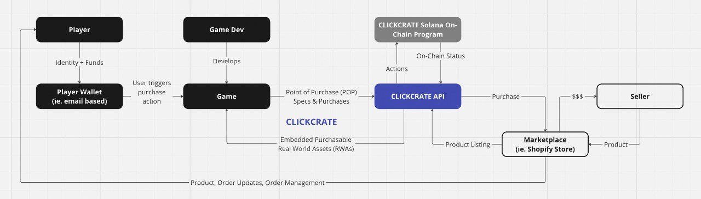

# ClickCrate

Sell Real World Assets (RWAs) in games with two clicks

## Get Started

**ClickCrate API _(@/clickcrate-api)_** - Node.js API deployed to gcloud that interacts with on-chain Solana ClickCrate program

**ClickCrate Program _(@/programs/lib.rs)_** - Core on-chain Solana ClickCrate program

**ClickCrate POC Integration** - ClickCrate API integrated into [Slip & Slither](https://slipandslither.r3x.tech/) game together with OraHacks NFTs ([Slip & Slither Game Repo](https://github.com/r3x-tech/slip-and-slither)

[ClickCrate Shopify Store](https://github.com/r3x-tech/slip-and-slither) - Shopify Store from where items are sourced for POC

[ClickCrate Dashboard](https://github.com/r3x-tech/clickcrate-dashboard) - Dashboard for no code sellers to work with ClickCrate API when creating products.

## Introduction to ClickCrate

Digital Sales is already hard but over coming years it will get even harder.

People are increasingly experiencing ad fatigue resulting in Click-through-Rates failing advertisers and ads efficiency falling ~15-20% YoY. The ever increasing Cost per Click as well as Cost per Mile as online sales increase are making the final product sale more and more expensive. Retail Media Networks rule e-commerce and ads with 80% of market attributed to 4 companies resulting in a direct sales monopoly. But perhaps worst of all in an unprecedented mark-up in the history of sales, app stores take a 30% cut from all sales in the form of in-app purchases. This is unsustainable and a shift has already begun. Increasing as ad spend and market competition is driving sales to move beyond the online store shopping experiences that we all know to a growing 310 million social media users. Novel methods like influencer
driven sales, direct in-post purchasing, and flash sales during streams are seeing traction. Through it all it has become apparent that direct sales remain the most cost effective option. However, as social media is gobbled up by the big players gaming remains the next biggest and a somewhat untapped market for direct sales.

That is why we built CLICKCRATE. An easy to use API and soon to come SDK that allows game developers to sell real world assets in their game in as little as two clicks. To start when simply request an API Key, create/register your in-game Point of Purchase (POP) through the create-clickcrate/register-clickcrate endpoints, and when you’re ready to start earning integrate the make-purchase api call into your the game logic associated with your Point of Purchase (POP) to allow users to purchase embedded real world assets.

While your CLICKCRATE is being created sellers are similarly creating/registering their products and once they are in our system our dynamic algorithm secured by blockchain and soon to be powered by AI will automatically find the perfect product to place in your Point of Purchase (POP). As the inventory for a product placed into your Point of Purchase (POP) sells you will receive earnings according to the fee that you specified during your CLICKCRATE’s creation.

But the best part? Your sales are direct and your earnings from product placements are 100% yours, not beholden to the 30% fee of app stores.

What are you waiting for? It’s time for players to unlock a truly seamless ecommerce experience that connects the digital and physical worlds so checkout the ClickCrate POC here: https://slipandslither.r3x.tech/

Or just watch the demo video found in our pitch deck here:
https://www.canva.com/design/DAGBu8X1M74/bFMQtMB6AXfB41f5wmJ6zA/edit?utm_content=DAGBu8X1M74&utm_campaign=designshare&utm_medium=link2&utm_source=sharebutton

## Architecture

